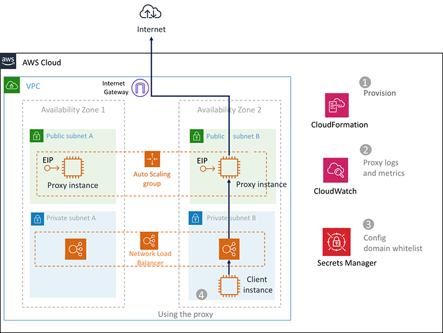

# 👮 AWS Security: Content Filtering & Domain Whitelisting with Squid proxy

Limiting outbound traffic to trusted domains (called `whitelisting`) prevent instances from downloading malware, communicating with bot networks.  You will learn how to limit outbound web connections from your VPC to the internet, using a web proxy with custom domain whitelists or DNS content filtering services.

Follow this article in **[Udemy][101]**



1. ## Prerequisites

    This demo, instructions, scripts and cloudformation template is designed to be run in `us-east-1`. With few modifications you can try it out in other regions as well(_Not covered here_).

    - AWS CLI pre-configured - [Get help here](https://youtu.be/TPyyfmQte0U)

1. ## Deployment

      Use the cloudformation template here in the repo and deploy using cli,

    ```bash
    aws cloudformation deploy \
        --template-file ./templates/vpc_bastion_private_instance.json \
        --stack-name "MiztiikAutomationNetWorkStack" \
        --capabilities CAPABILITY_IAM
    ```

    ```bash
    aws cloudformation deploy \
        --template-file ./templates/content-filtering-with-proxy.yaml \
        --stack-name "MiztiikAutomationProxyStack" \
        --capabilities CAPABILITY_IAM
    ```

1. ## Testing the solution

    1. Connect to Bastion
    1. Copy your Private Instance SSH key to Bastion
    1. Connect to Secure Instance from Bastion
    1. `curl` any website - It should fail
    1. Set the proxy url from cloudformation outputs in `MiztiikAutomationProxyStack`
    1. `curl` for `whitelisted` domains
    1. `curl` for _non-whitelisted_ domains: This should throw `Access Denied.` error

1. ## CleanUp

    If you want to destroy all the resources created by the stack, Execute the below command to delete the stack, or _you can delete the stack from console as well_

    ```bash
    # Delete the CF Stack
    aws cloudformation delete-stack \
        --stack-name "MiztiikAutomationProxyStack" \
        --region "${AWS_REGION}"
    aws cloudformation delete-stack \
        --stack-name "MiztiikAutomationNetWorkStack" \
        --region "${AWS_REGION}"
    ```

    This is not an exhaustive list, please carry out other necessary steps as maybe applicable to your needs.

## 📌 Who is using this

This Udemy [course][101] uses this repository extensively to teach advanced AWS Cloud Security to new developers, Solution Architects & Ops Engineers in AWS.

### 💡 Help/Suggestions or 🐛 Bugs

Thank you for your interest in contributing to our project. Whether it's a bug report, new feature, correction, or additional documentation or solutions, we greatly value feedback and contributions from our community. [Start here][200]

### 👋 Buy me a coffee

Buy me a [coffee ☕][900].

### 📚 References

1. [VPC Egress Control][1]
1. [Squid][2]

### 🏷️ Metadata

**Level**: 200

[1]: https://aws.amazon.com/answers/networking/controlling-vpc-egress-traffic/

[2]: http://www.squid-cache.org/

[100]: https://www.udemy.com/course/aws-cloud-security/?referralCode=B7F1B6C78B45ADAF77A9

[101]: https://www.udemy.com/course/aws-cloud-security-proactive-way/?referralCode=71DC542AD4481309A441

[102]: https://www.udemy.com/course/aws-cloud-development-kit-from-beginner-to-professional/?referralCode=E15D7FB64E417C547579

[103]: https://www.udemy.com/course/aws-cloudformation-basics?referralCode=93AD3B1530BC871093D6

[200]: https://github.com/miztiik/dev-sec-ops/issues

[899]: https://www.udemy.com/user/n-kumar/

[900]: https://ko-fi.com/miztiik
