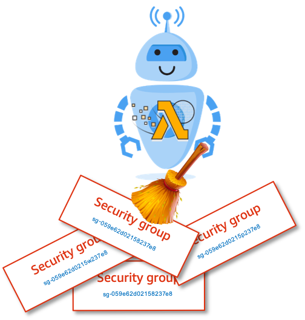

# 👮 Security: Automatically remove unused old security groups using AWS Lambda

Maintaining security groups across multiple VPCs, regions, accounts is quite an time consuming effort. [I][899] decided to automate this, with an lambda.

Follow this article in **[Udemy][101]**

## Lambda Functionality

The following actions are performed by the lambda

1. Make a list of security groups
1. Remove the ones used by ec2 instances
1. Removed the excluded security group
1. Return a list of `security_group_ids` deleted
1. Cloudwatch events is configured to trigger this lambda once every week.

It is quite extensible, you can extend this functionality to add an exclude list or process the deleted ids in another automation task.

## Lab Setup

  In this repo, I have included a cloudformation template(look for `/cdk.out/remove-unused-security-groups.template.json`) that provisions all the necessary resources.

- Lambda to delete security groups
- IAM Role for the lambda execution
  - Necessary permissions for the lambda
  - _If your lambda is timing out, increase the duration_

## Test

I have included a simple script `test_data/create_dummy_sgs.sh`. Update the `vpc_to_spam` variable to match yours and run it to create some dummy sgs. Run the lambda function in the console and check the logs.

Thank you for your interest in contributing to our project. Whether it's a bug report, new feature, correction, or additional documentation or solutions, we greatly value feedback and contributions from our community. [Start here][200]

## 📌 Who is using this

This Udemy [course][101] uses this repository extensively to teach advanced AWS Cloud Security to new developers, Solution Architects & Ops Engineers in AWS.

### 💡 Help/Suggestions or 🐛 Bugs

Thank you for your interest in contributing to our project. Whether it's a bug report, new feature, correction, or additional documentation or solutions, we greatly value feedback and contributions from our community. [Start here][200]

### 👋 Buy me a coffee

Buy me a [coffee ☕][900].

### 📚 References

1. [AWS Serverless Janitor for launch-wizard Security Groups][1]

### 🏷️ Metadata

**Level**: 100

[1]: https://github.com/miztiik/serverless-janitor-for-security-groups

[100]: https://www.udemy.com/course/aws-cloud-security/?referralCode=B7F1B6C78B45ADAF77A9

[101]: https://www.udemy.com/course/aws-cloud-security-proactive-way/?referralCode=71DC542AD4481309A441

[102]: https://www.udemy.com/course/aws-cloud-development-kit-from-beginner-to-professional/?referralCode=E15D7FB64E417C547579

[103]: https://www.udemy.com/course/aws-cloudformation-basics?referralCode=93AD3B1530BC871093D6

[200]: https://github.com/miztiik/dev-sec-ops/issues

[899]: https://www.udemy.com/user/n-kumar/

[900]: https://ko-fi.com/miztiik
