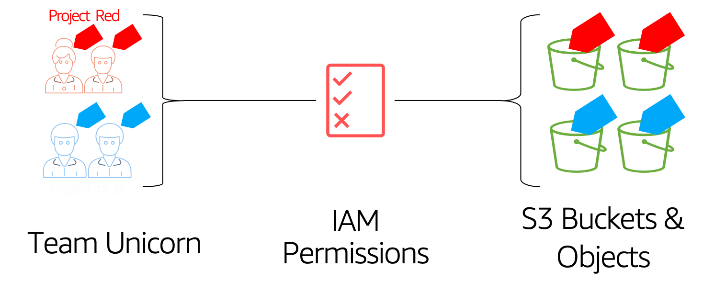

# 👮AWS Security: Restrict S3 Object Access based on Tags 🏷 - ABAC

Attribute-based access control (ABAC) is an authorization strategy that defines permissions based on attributes. In AWS, these attributes are called tags. ABAC allows you the same fine grained access control model like "Role Based Access Control-RBAC", in addition to that you can easily scale your permissions to any number of resources, identities. _[Read More](https://docs.aws.amazon.com/IAM/latest/UserGuide/introduction_attribute-based-access-control.html)_



Follow this article in **[Youtube](https://www.youtube.com/c/ValaxyTechnologies)**

Our customer has a bucket with many objects accessed by multiple people. There no prefixes and all objects are in the same directory(root) of the bucket. Access to the objects depend on the team the users are member of. 

Lets imagine `teamUnicorn` working on two awesome projects, `projectRed` and `projectBlue`, It becomes very very difficult without re-structing the bucket to restrict object level access. Using ABAC, we can implement a _IAM_ policy that allows users access to objects that are specficially tagged for their teams.

- `projectRed` should be allowed access to objects tagged `projectName=projectRed` only and nothing else.
- `projectBlue` should be allowed access to objects tagged `projectName=projectBlue` only and nothing else.

1. ## Prerequisites

    This demo, instructions, scripts and cloudformation template is designed to be run in `us-east-1`. With few modifications you can try it out in other regions as well(_Not covered here_).

    - AWS CLI pre-configured - [Get help here](https://youtu.be/TPyyfmQte0U)
    - **Optional** AWS CDK Installed & Configured - [Get help here](https://www.youtube.com/watch?v=MKwxpszw0Rc)


1. ## Environment Setup

    In this repo, I have included a cloudformation template that provisions the resources to setup a fully automatic policy remedation engine.

    - **S3 Bucket**: We will use this bucket to test attribute based access control
    - **IAM Group**: `teamUnicorn`
        - _Allows assume role privileges only when member of `teamUnicorn`_
    - **IAM User**: `redRosy` part of `projectRed`
    - **IAM User**: `blueBob` part of `projectBlue`
    - **IAM Roles**:
        -  `teamUnicornProjectRedRole` - With condition matching for team and project tags
        -  `teamUnicornProjectBlueRole` - With condition matching for team and project tags

    _**Note**: Sample commands/urls to test the solution can be found in the output section of the cloudformation template_

1. ## Deployment

    You have couple of options to set this up in your account, You can use [AWS CDK](https://www.youtube.com/watch?v=MKwxpszw0Rc) or use the cloudformation template generated by CDK. All the necessary steps are baked into the templates, you can launch it and try it out.

  1. ### Method 1: Using AWS CDK

      If you have AWS CDK installed you can close this repository and deploy the stack with,

        ```bash
        # If you DONT have cdk installed
        npm install -g aws-cdk

        git clone https://github.com/miztiik/dev-sec-ops.git
        cd dev-sec-ops/s3-restrict-object-access-based-on-tags-abac
        source .env/bin/activate
        pip install -r requirements.txt
        ```

      The very first time you deploy an AWS CDK app into an environment _(account/region)_, you’ll need to install a `bootstrap stack`, Otherwise just go aheadand   deploy using `cdk deploy`

        ```bash
        cdk bootstrap
        cdk deploy
        ```

  1. ### Method 2: Using AWS CloudFormation

      Look for the cloudformation template here: `cdk.out` directory, _From the CLI,_

        ```sh
        aws cloudformation deploy \
            --template-file ./cdk.out/s3-restrict-object-access-based-on-tags-abac.template.json \
            --stack-name "MiztiikAutomationStack" \
            --capabilities CAPABILITY_IAM
        ```

1. ## Testing the solution

    In the `Outputs` section of the cloudformation template we have,

    - Passwords for the users
    - Login Url & AssumeRole Url
    - `S3 bucket` link for updating objects

    This is what, we are going to do now,

    1. As `Admin` upload the files in `sample_files` directory with the appropriate `project*` tags.
    1. Login as `redRosy` from different browser
    1. Switch to Role `teamUnicornProjectRedRole` and access S3 private bucket
    1. Try to open/download `redWelcome.html` file, try other files
    1. Try uploading objects, without tags
    1. Try uploading objects with tags `projectName` and `teamName` with appropriate values

    Repeat excercise with `blueBob`

    If you want to try an upload with CLI, sample commands

    ```bash
    aws s3api put-object-tagging --bucket YOUR-BUCKET-NAME --key SAMPLE-OBJECT-NAME --tagging 'TagSet=[{Key=teamName,Value=teamBlue}]'
    aws s3api put-object --bucket YOUR-BUCKET-NAME --key SAMPLE-OBJECT-NAME --tagging 'Key=teamName&Value=teamBlue'
    ```

1. ## Next Steps: Do Try This

    - The `annoyingAdmin` S3 policy is W.I.P. That can be completed.


1. ## CleanUp

    If you want to destroy all the resources created by the stack, Execute the below command to delete the stack, or _you can delete the stack from console as well_

    1. Delete S3 Buckets - as required
    1. Delete the stack[s],

    ```bash
    # Delete the CF Stack
    aws cloudformation delete-stack \
        --stack-name "MiztiikAutomationStack" \
        --region "${AWS_REGION}"
    ```

    This is not an exhaustive list, please carry out other necessary steps as maybe applicable to your needs.


## Buy me a coffee

Buy me a coffee ☕ through [Paypal](https://paypal.me/valaxy), _or_ You can reach out to get more details through [here](https://youtube.com/c/valaxytechnologies/about).

#### References

1. [IAM policy tags to restrict Access](https://aws.amazon.com/premiumsupport/knowledge-center/iam-policy-tags-restrict/)

1. [Working Backwards: Tags for your AWS resources](https://aws.amazon.com/blogs/security/working-backward-from-iam-policies-and-principal-tags-to-standardized-names-and-tags-for-your-aws-resources/)
1. [Example Policies EC2 ](https://docs.aws.amazon.com/AWSEC2/latest/UserGuide/iam-policies-ec2-console.html)
1. [Specifying Conditions in a S3 Policy](https://docs.aws.amazon.com/AmazonS3/latest/dev/amazon-s3-policy-keys.html#bucket-keys-in-amazon-s3-policies)
1. [AWS Services That Work with IAM](https://docs.aws.amazon.com/IAM/latest/UserGuide/reference_aws-services-that-work-with-iam.html)

### Metadata

**Level**: 200
