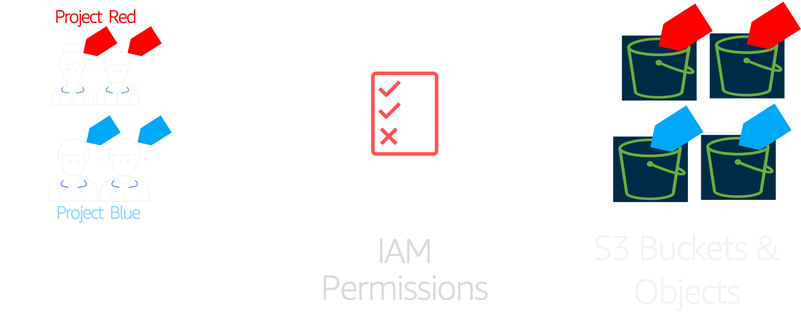

# AWS Security: Restrict S3 Object Access based on Tags 🏷 - ABAC

Attribute-based access control (ABAC) is an authorization strategy that defines permissions based on attributes. In AWS, these attributes are called tags. ABAC allows you the same fine grained access control model like "Role Based Access Control-RBAC", in addition to that you can easily scale your permissions to any number of resources, identities. _[Read More](https://docs.aws.amazon.com/IAM/latest/UserGuide/introduction_attribute-based-access-control.html)_



Follow this article in **[Youtube](https://www.youtube.com/c/ValaxyTechnologies)**

Our customer has a bucket with many objects accessed by multiple people. There no prefixes and all objects are in the same directory(root) of the bucket. Access to the objects depend on the team the users are member of. 

Lets imagine `teamUnicorn` working on two awesome projects, `projectRed` and `projectBlue`, It becomes very very difficult without re-structing the bucket to restrict object level access. Using ABAC, we can implement a _IAM_ policy that allows users access to objects that are specficially tagged for their teams.

- `projectRed` should be allowed access to objects tagged `projectName=projectRed` only and nothing else.
- `projectBlue` should be allowed access to objects tagged `projectName=projectBlue` only and nothing else.

### 

```sh
{
    "Version": "2012-10-17",
    "Statement": [
        {
            "Sid": "AllowGroupToSeeBucketListInTheConsole",
            "Sid": "AllowGroupToSeeBucketListAndAlsoAllowGetBucketLocationRequiredForListBucket",
            "Effect": "Allow",
            "Action": [
                "s3:ListAllMyBuckets",
                "s3:GetBucketLocation",
                "s3:HeadBucket"
            ],
            "Resource": ["arn:aws:s3:::*"]
        },
        {
            "Sid": "AllowRootLevelListingOfCompanyBucket",
            "Effect": "Allow",
            "Action": "s3:ListBucket",
            "Resource": "arn:aws:s3:::tag-based-object-access-010"
        },
        {
            "Sid": "RestrictAccessOnTeamName",
            "Effect": "Allow",
            "Action": "s3:*",
            "Resource": "arn:aws:s3:::tag-based-object-access-010/*",
            "Condition": {
                "StringEquals": {
                    "s3:ExistingObjectTag/teamName": "teamBlue"
                }
            }
        }
    ]
}
```

```sh
aws s3api put-object-tagging --bucket YOUR-BUCKET-NAME --key SAMPLE-OBJECT-NAME --tagging 'TagSet=[{Key=teamName,Value=teamBlue}]'

aws s3api put-object --bucket YOUR-BUCKET-NAME --key SAMPLE-OBJECT-NAME --tagging 'Key=teamName&Value=teamBlue'
```

### Buy me a coffee

Buy me a coffee ☕ here `https://paypal.me/valaxy`, _or_ You can reach out to get more details through [here](https://youtube.com/c/valaxytechnologies/about).

#### References

1. [IAM policy tags to restrict Access](https://aws.amazon.com/premiumsupport/knowledge-center/iam-policy-tags-restrict/)

1. [Working Backwards: Tags for your AWS resources](https://aws.amazon.com/blogs/security/working-backward-from-iam-policies-and-principal-tags-to-standardized-names-and-tags-for-your-aws-resources/)
1. [Example Policies EC2 ](https://docs.aws.amazon.com/AWSEC2/latest/UserGuide/iam-policies-ec2-console.html)
1. [Specifying Conditions in a S3 Policy](https://docs.aws.amazon.com/AmazonS3/latest/dev/amazon-s3-policy-keys.html#bucket-keys-in-amazon-s3-policies)
1. [AWS Services That Work with IAM](https://docs.aws.amazon.com/IAM/latest/UserGuide/reference_aws-services-that-work-with-iam.html)

### Metadata

**Level**: 200
